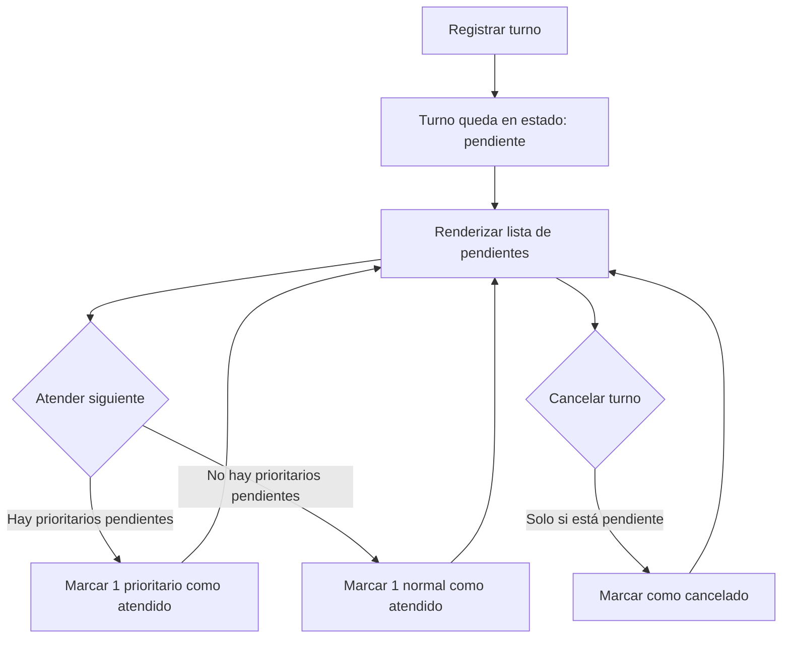
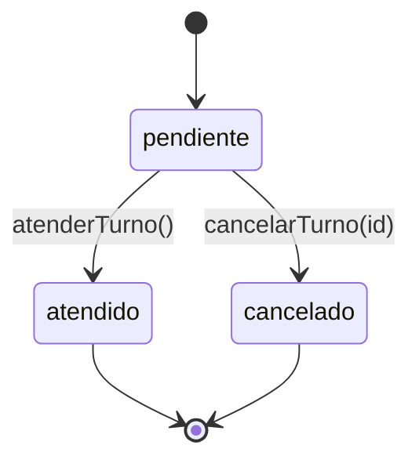

# Sistema de Gestión de Turnos

Proyecto simple (sin frameworks) para registrar, priorizar, atender y cancelar turnos de atención a clientes. El enfoque está en la lógica, el manejo de estados y la claridad del diseño.

## Objetivo de la actividad
Demostrar dominio de:
- Programación básica
- Lógica de programación (prioridades y orden)
- Manejo de estados
- Claridad en el razonamiento y decisiones

## Contexto
Un negocio necesita un sistema sencillo para administrar turnos. Debe permitir:
- Registrar turnos normales y prioritarios
- Mostrar turnos pendientes
- Atender el siguiente turno respetando reglas
- Cancelar turnos

## Cómo ejecutar
1. Abre `index.html` en tu navegador.
2. Selecciona el tipo de turno.
3. Usa los botones para registrar o atender.
4. Cancela un turno pendiente con el botón `✕`.

No requiere instalación ni dependencias.

## Estructura del proyecto
- `index.html`: interfaz mínima (select, botones y lista).
- `styles.css`: estilos (tarjetas, botones, layout responsivo).
- `script.js`: lógica de negocio (turnos, estados, prioridad, renderizado).

## Flujo general (lógica y estados)

### Flujo de acciones

### Estados del turno

## Fase 1: Modelado del problema

### ¿Qué es un turno?
Un turno representa una solicitud de atención de un cliente en un momento dado.

### Información mínima que contiene
En `script.js` cada turno se modela como un objeto con:
- `id`: identificador incremental (1, 2, 3, …)
- `tipo`: `normal` o `prioritario`
- `estado`: `pendiente`, `atendido` o `cancelado`
- `fecha`: timestamp (`Date.now()`) útil para trazabilidad/orden temporal

### Estados de un turno
Se definen como constantes:
- **Pendiente**: turno activo, elegible para ser atendido.
- **Atendido**: turno ya procesado.
- **Cancelado**: turno anulado; no debe poder atenderse.

### Reglas para atender turnos
1. Siempre se atienden primero los turnos **prioritarios pendientes**.
2. Si no hay prioritarios pendientes, se atienden los **normales pendientes**.
3. Dentro de cada tipo se respeta el **orden de llegada**.
4. El sistema no debe fallar si no hay pendientes (muestra un aviso).
5. No se puede atender un turno que no esté **pendiente**.

## Fase 2 y 3: Funcionalidad implementada

### Registrar turno
- Función: `registrarTurno()`
- Acción: agrega un nuevo objeto turno al arreglo `turnos` con estado `pendiente`.

### Mostrar turnos pendientes
- Función: `renderizarTurnos()`
- Acción: filtra `turnos` por `estado === pendiente` y los pinta en la UI.

### Atender siguiente turno (con prioridad)
- Función: `atenderTurno()`
- Lógica:
	- Busca primero `prioritario` + `pendiente`.
	- Si no existe, busca `normal` + `pendiente`.
	- Toma el primero encontrado y cambia su estado a `atendido`.
	- Si no hay pendientes, muestra `alert("No hay turnos pendientes")`.

### Cancelar turno
- Función: `cancelarTurno(id)`
- Regla: solo permite cancelar si el turno está en estado `pendiente`.
- Acción: cambia el estado a `cancelado` y re-renderiza.

## Decisiones lógicas importantes
- **Estados explícitos**: un turno siempre está en un estado bien definido; esto evita “comportamientos mágicos”.
- **Atención por filtrado**: para garantizar coherencia, siempre se calcula el siguiente turno desde los pendientes (evita atender cancelados/atendidos).
- **Orden de llegada**: el arreglo `turnos` conserva el orden de inserción, por lo que tomar el primer pendiente de cada tipo respeta FIFO.
- **Separación mínima**:
	- Lógica: creación/selección/cambio de estado en `script.js`.
	- Presentación: HTML/CSS en `index.html` y `styles.css`.

## Casos límite cubiertos
- Atender cuando no hay turnos pendientes: el sistema no falla, muestra un aviso.
- Intento de cancelar un turno ya atendido/cancelado: no realiza cambios.
- Evitar atender turnos cancelados o atendidos: solo se consideran pendientes.

## Qué mejoraría con más tiempo
- **Persistencia**: guardar y cargar turnos desde `localStorage` para mantener el estado al recargar.
- **Mejor estructura**: separar lógica de negocio en un módulo/clase (ej. `Turnero`) y dejar la UI como “capa” aparte.
- **Pruebas**: agregar pruebas unitarias de reglas (prioridad, FIFO, estados) con un runner ligero.
- **Eficiencia**: para muchos turnos, usar colas separadas (normal/prioritario) en vez de filtrar el arreglo completo en cada acción.
- **Accesibilidad/UI**: mensajes no bloqueantes en vez de `alert`, y mejoras ARIA.

